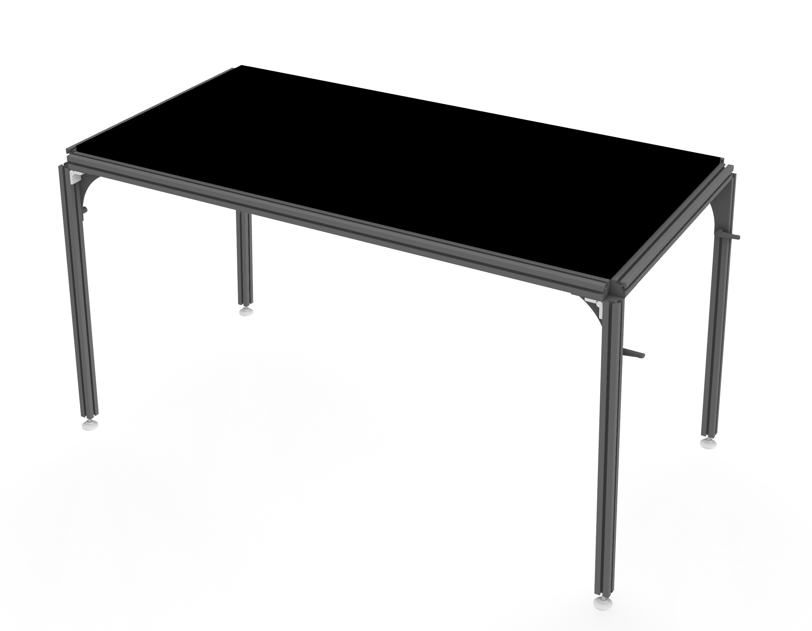

## Open Hardware Multifunction Table WIP ##
___
The above repository serves as the main documentation associated with assemblies of the multifunction table.

 
Current state of devlopment.

## Licenses ##
___
The following licenses are used:  
&nbsp;&nbsp;&nbsp;&nbsp;Technical drawings, CAD models, bills of materials, and other design materials, in any format 
&nbsp;&nbsp;&nbsp;&nbsp;now known or later developed: [CERN-OHL-S v2](LICENSE)  
&nbsp;&nbsp;&nbsp;&nbsp;All supporting materials, including but not limited to written documentation, manuals, diagrams, 
&nbsp;&nbsp;&nbsp;&nbsp;images, photographs, audio recordings, and audiovisual works: [CC BY-SA 4.0](https://creativecommons.org/licenses/by-sa/4.0/legalcode)