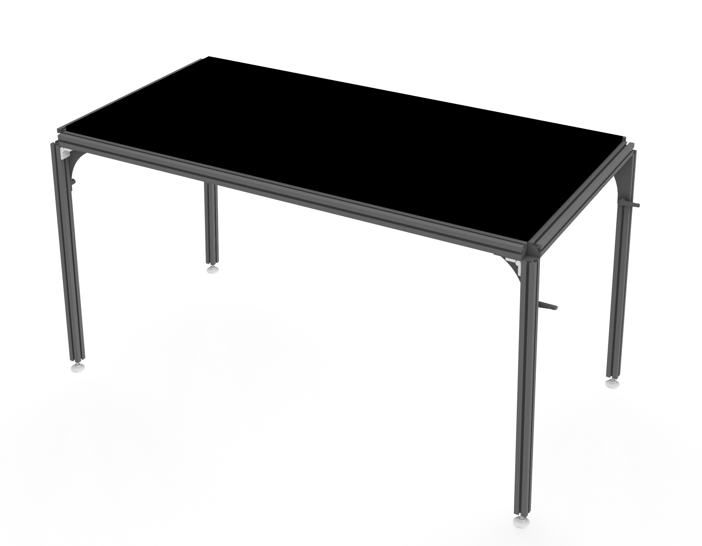

## Open Hardware Multifunction Table WIP ##
___
The above repository serves as the main documentation associated with assemblies of the multifunction table. 
Under the CERN-OHL-S v2 license documentation includes the bill of materials, assembly instructions, STEP files,
etc. which eventually will be found here.

